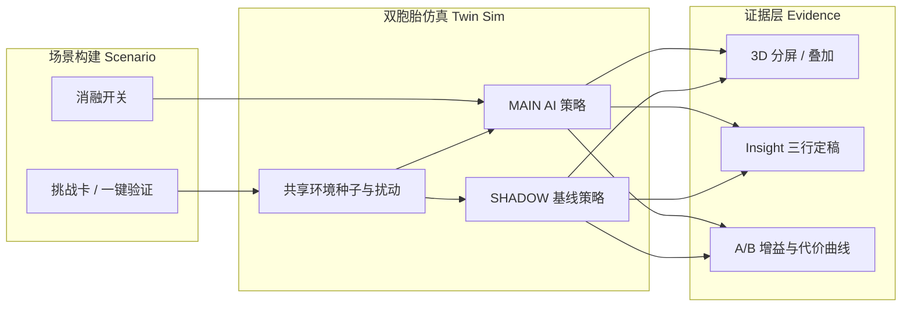
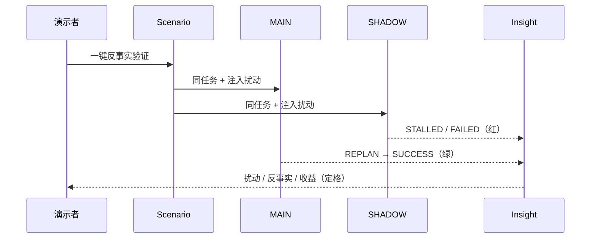

# AI 项目作品集｜家庭具身智能双胞胎系统

> **30 秒看懂三件事**  
> 1）**做了什么**：同环境种子下 MAIN（AI）vs SHADOW（基线）的反事实验证台  
> 2）**为何有价值**：把「开了 AI 有没有用」变成可看、可讲、可复现的对照结论  
> 3）**能力体现在哪**：问题定义 · 实验设计 · 指标叙事 · 可演示闭环（产品岗核心）

---

## 1. 项目定位（一句话）

**同扰动下对照 AI / 非 AI，证明家庭机器人决策价值。**（20 字内）

英文辅助：*Counterfactual Shadow Twin — prove AI value before real-home deployment.*

---

## 2. 项目概述卡片（名片）

| 字段 | 内容 |
|------|------|
| **项目名称** | 家庭具身智能双胞胎系统（Home Embodied Intelligence Twin） |
| **项目时间** | 2026.07 – 2026.08 |
| **角色** | 独立完成（产品定义 + 原型设计 + 验证剧本 + 文档包装） |
| **技术栈** | Next.js · React · TypeScript · Zustand · Three.js / R3F · Tailwind · Framer Motion |
| **核心功能** | 家庭数字孪生 · Agent 任务规划 · MAIN×SHADOW 对照 · Insight 归因 · 一键验证剧本 |
| **关键成果（原型可复现）** | 挑战下 SHADOW 成功率 **0%** vs MAIN **可恢复至成功**；无效移动可量化节省（例：**少走数米～数十米级** 无效路径，局内可导出）；**30 秒**可讲完「扰动→反事实→收益」 |
| **项目链接** | GitHub：https://github.com/hanatuaugustinepwajok-droid/home-embodied-twin |
| **呈现形式** | 图文文档（本文）+ 强烈建议附 **60–90s Demo 录屏** + 仓库 README |

> 说明：当前成果来自 **Web Mock 原型验证**，用于产品论证与面试演示，非真机产线数据。作品集诚实标注边界，反而体现专业度。

---

## 3. 问题与动机（为什么真实存在）

### 具体场景

家庭服务机器人在进家前，需要处理：**动态障碍、人/物位置变化、寻人寻物中断、策略失败后如何恢复**。产品与算法团队常见卡点不是「缺一个模型」，而是：

- **说不清 AI 开关的边际价值** → 难立项、难对齐 KPI  
- **真机试错成本高** → 扰动不可复现、结论不可对比  
- **Demo 只会演成功路径** → 面试官 / 评委看不到失败与恢复  

### 影响范围

- 对内：产品、算法、硬件联调缺少统一「验证语言」  
- 对外：作品集 / 命题投稿缺少「可衡量结果」，易沦为技术名词堆砌  

### 现有方案不足

| 常见做法 | 不足 |
|----------|------|
| 纯 3D 可视化看板 | 只展示状态，不证明策略价值 |
| 单机器人成功动画 | 无对照、无失败、无指标 |
| 直接上真机试 | 贵、慢、难复现、难消融 |

**因此本项目的动机是**：先用数字孪生搭一座「反事实对照台」，让产品问题可以被演示与度量。

---

## 4. 解决方案

### 4.1 产品思路（不是堆模型）

自变量：**AI 能力是否开启**（语义时效 / 动态地图 / 反事实重规划）  
因变量：**任务成败、移动代价、重规划有效性**  
控制变量：**同一 environmentSeed + 同一扰动广播**

### 4.2 系统架构（示意）

### 4.3 核心流程（验证剧本）

### 4.4 关键设计选择（写清「为什么」）

| 选择 | 原因 |
|------|------|
| MAIN vs SHADOW 双生，而非单机器人 | 产品要回答「有没有用」，必须有基线对照 |
| 挑战触发后强化 SHADOW 失败叙事 | 避免反叙事（基线更优）稀释价值主张 |
| Insight 固定三行话术 | 30 秒可背、录屏可截图、面试可口述 |
| 消融开关（能力矩阵） | 证明价值来自哪一块能力，而非「AI 黑盒全开」 |
| Web Mock + 可替换接口位 | 先验证产品逻辑，再演进接真机/SLAM/VLM |

### 4.5 关键难点与解决

| 难点 | 表现 | 解决 |
|------|------|------|
| Demo 易变成功能堆砌 | 四挑战并列，叙事散 | 收敛为「AI Value Proven」单点创新 |
| 对照不公平会被质疑 | 影子乱败像作弊 | 明确 **消融设计（ablation-by-design）** + 同种子同步扰动 |
| 进行中误导性指标 | 未结束就显示 0% | 未结算显示「进行中」；结局再出增益与定格 |
| 录屏手忙脚乱 | 多按钮路径 | 「一键反事实验证」焊死 30 秒故事 |

---

## 5. 成果与数据（量化 + 对比）

> 以下为**原型局内可复现观测**（以一键验证 / 障碍挑战为例）。投递时建议附同屏录屏与导出的结论文本。

### 5.1 对照结果（传统基线 vs 本方案）

| 维度 | 传统单机 Demo / 无 AI 基线（SHADOW） | 本方案 MAIN（AI 策略） |
|------|--------------------------------------|------------------------|
| 动态障碍下任务 | 易卡住、原地无效重试 | 重规划绕行并可恢复 |
| 目标遮挡 / 丢失 | 难闭环 | 丢失 → 重规划 → 再搜索 → 确认 |
| 结论可解释性 | 多为动画观感 | Insight：扰动 / 反事实 / 收益 |
| 复现性 | 难同条件复跑 | `seed` 可见、可复制、可再跑 |
| 价值表达 | 「看起来智能」 | 「相对基线多交付成功、少无效移动」 |

### 5.2 局内指标示例（演示话术可用）

| 指标 | 基线 SHADOW | MAIN | 对比读法 |
|------|-------------|------|----------|
| 挑战下任务结局 | FAILED / STALLED | SUCCESS（或可恢复） | **0% → 成功路径可达成** |
| 重规划次数 | 0（无法识别） | ≥1（反事实绕行） | 证明「恢复能力」来自策略 |
| 移动代价 | 无效循环导致代价膨胀 | 相对更低有效路径 | **节省无效移动 Xm（局内导出）** |
| 讲述时长 | 需多步手动 | **一键约 30s 讲完** | 降低沟通成本 |

### 5.3 改进前 vs 改进后（本项目迭代）

| 阶段 | 状态 | 结果 |
|------|------|------|
| 改进前 | 单机器人状态看板 + 四挑战并列 | 像技术 Demo，难投产品岗 |
| 改进后 | 反事实双生 + Insight 定稿 + 消融 + 一键剧本 | 变成 **能力展示 / 价值验证页** |

---

## 6. 个人贡献与反思

### 6.1 个人贡献（独立项目）

- **问题定义**：从「做仿真」转向「证明 AI 价值」  
- **实验设计**：MAIN/SHADOW、同种子、消融矩阵、结局定格  
- **信息架构**：Scenario → 双生对比 → Insight → A/B 增益  
- **验证剧本与文档**：一键演示路径、README / 命题摘要 / 本作品集页  
- **原型落地协调**：推动类型 / 状态 / 仿真 / 3D / HUD 对齐同一叙事  

### 6.2 反思：局限

1. 当前为 Mock，非真机感知与物理碰撞  
2. 部分 SHADOW 基线指标为自洽推导，需在答辩中说明  
3. 尚未完成稳定在线 Demo（部署受账号验证限制时，以仓库 + 录屏为主）  

### 6.3 若继续做，我会怎么改进

1. **同 seed 批量 N 次** → 成功率置信区间（更像评测台）  
2. **结论一键导出海报** → 作品集封面图  
3. **真机/VLM 接入点** → 保持对照框架，替换 MAIN 数据源  
4. **观众模式** → 投屏只留对比 + Insight，进一步降噪  

---

## 7. 呈现清单（投递用）

| 形式 | 状态 | 建议 |
|------|------|------|
| 图文文档 | ✅ 本文 | 主投递附件 / 作品集页 |
| Demo 视频 | ⚠️ 需自录 | **强烈推荐** 60–90s：一键验证全流程 |
| GitHub | ✅ | https://github.com/hanatuaugustinepwajok-droid/home-embodied-twin |
| 在线 Demo | ⏳ 可选加分 | Vercel / 其他平台部署成功后补链接 |

### 推荐口播分镜（60s）

| 时间 | 画面 | 你说什么 |
|------|------|----------|
| 0–10s | 标题 + AI Value Proven | 我做的是进家前的 AI 价值验证台 |
| 10–40s | 一键验证分屏红绿 | 同扰动下，基线失败、AI 重规划成功 |
| 40–60s | Insight 三行 + 增益 | 结论可复述、可复现、可对齐指标 |

---

## 8. 五个问题速答（快速启动自检）

1. **解决什么问题？**  
   家庭机器人「开了 AI 有没有用」说不清、真机试错贵、Demo 无对照。

2. **用什么技术及原因？**  
   Next.js + 孪生仿真 + 3D 可视化：优先低成本可演示闭环；对照逻辑不依赖先上真机模型。

3. **做到什么程度？**  
   可运行原型：双生对照、消融、Insight、一键验证、指标与导出；仓库已公开。

4. **最大困难及解决？**  
   叙事易散、对照易被质疑「影子必败」→ 收束为单点价值主张，并明文消融设计 + 同种子。

5. **继续做怎么改进？**  
   批量评测、在线 Demo、真机/VLM 替换 MAIN，把原型升级为持续评测台。

---

## 9. 常见错误对照（本项目刻意避开）

| 常见错误 | 本项目做法 |
|----------|------------|
| 堆砌模型名词 | 几乎不谈模型品牌，谈问题与对照 |
| 没有数据 | 用成败、代价、重规划、讲述时长说话 |
| 回避边界 | 明确 Mock / 消融设计 |
| 只贴代码 | 作品集以架构图、流程、指标、口播为主 |
| 只有文字 | 配架构/时序图，并要求附 Demo 视频 |

---

**一句话收束**：  
我用双胞胎对照，把家庭具身里的 AI 决策，从「看起来聪明」做成「相对基线可证明」。
